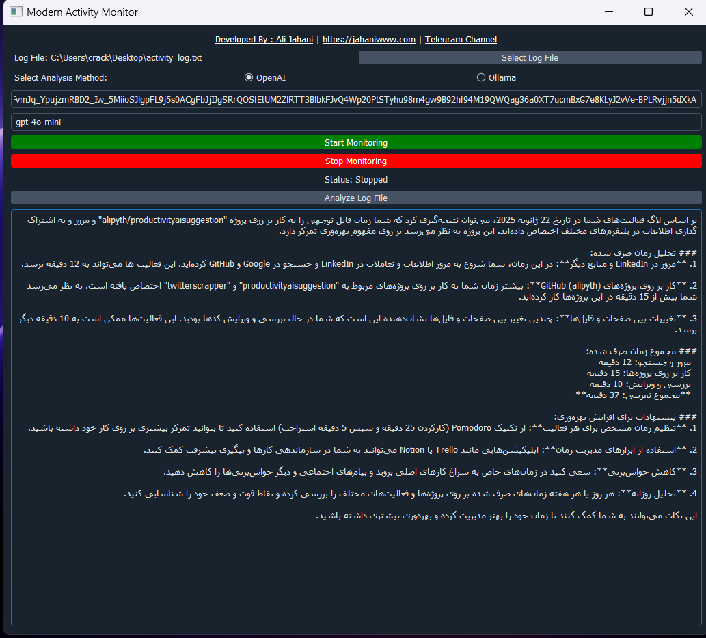

# Modern Activity Monitor

<p align="right">
این پروژه به شما کمک می‌کند تا با نظارت بر فعالیت‌های خود، بهره‌وری و مدیریت زمان خود را بهبود ببخشید. این ابزار امکان تجزیه و تحلیل فعالیت‌های شما را فراهم کرده و پیشنهاداتی برای افزایش تمرکز ارائه می‌دهد.
</p>

---

## ویژگی‌ها

<p align="right">
- **نظارت بر فعالیت‌ها**: مشاهده و ثبت فعالیت‌های شما در پلتفرم‌های مختلف.
- **تحلیل زمان مصرف‌شده**: محاسبه مجموع زمان صرف‌شده بر روی فعالیت‌های مختلف.
- **پیشنهادات بهره‌وری**: ارائه راهکارهای مفید برای بهبود مدیریت زمان و افزایش بهره‌وری.
</p>

---

## راهنمای استفاده

<p align="right">
1. برنامه را اجرا کنید و فایل لاگ را انتخاب کنید.
2. دکمه "Start Monitoring" را فشار دهید تا نظارت آغاز شود.
3. پس از اتمام کار، دکمه "Stop Monitoring" را فشار دهید.
4. با کلیک بر روی "Analyze Log File"، فعالیت‌ها تحلیل شده و گزارش تهیه می‌شود.
</p>

---

## نمونه خروجی

<p align="right">
تصویری از محیط برنامه و گزارش نمونه در زیر آورده شده است:
</p>

<p align="center">

</p>

---

## پیشنهادات بهره‌وری

<p align="right">
- از تکنیک **Pomodoro** استفاده کنید: 25 دقیقه تمرکز و 5 دقیقه استراحت.
- از ابزارهایی مانند **Notion** و **Trello** برای مدیریت پروژه‌ها استفاده کنید.
- مدت زمان مشخصی برای مرور شبکه‌های اجتماعی تعیین کنید و از وقفه‌های بیهوده جلوگیری کنید.
</p>

---

## پیش‌نیازها

<p align="right">
- سیستم‌عامل: ویندوز 10 یا بالاتر
- پایتون: نسخه 3.9 یا جدیدتر
- کتابخانه‌های موردنیاز: OpenAI، Ollama
</p>

---

## نصب و اجرا

<p align="right">
1. مخزن پروژه را کلون کنید:
   ```bash
   git clone https://github.com/your-repo/modern-activity-monitor.git
   ```
2. به پوشه پروژه بروید و پیش‌نیازها را نصب کنید:
   ```bash
   cd modern-activity-monitor
   pip install -r requirements.txt
   ```
3. برنامه را اجرا کنید:
   ```bash
   python app.py
   ```
</p>

---

## مشارکت

<p align="right">
اگر مایل به همکاری در توسعه این پروژه هستید، درخواست‌های پول (Pull Requests) خود را ارسال کنید یا با ما تماس بگیرید.
</p>

---

<p align="center">تهیه‌شده توسط علی جهانی | [وب‌سایت](https://jahaniwww.com)</p>
